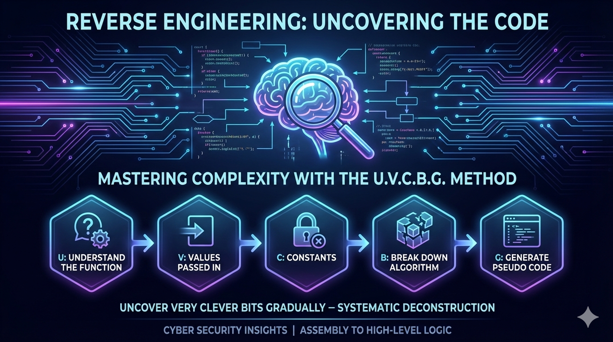

# Introduction
Recently, as I've been studying for one of my Binex/Reversing certifications, I've concluded: when it comes to reversing code, you will most certainly face challenges. Even simply following the flow of a program in assembly language can be difficult, sometimes requiring hours of breaking down the logic of functions at the most minute level. On top of that, trying to reconstruct the original code’s logic at a higher level of abstraction, translating it back into a more human-readable form, can be even more daunting and, at times, head-smashing.

I’ve found that the most effective way to approach reverse engineering, especially when dealing with encryption or obfuscation, is to break down each function into smaller, manageable steps systematically. By segmenting the problem, you can maintain clarity and avoid getting overwhelmed by the complexity of the assembly instructions or the algorithm. When breaking down a function, I typically follow the steps:

**Uncover Very Clever Bits Gradually**
<br><sub> _I developed the process; however, ChatGPT came up with the Mnemonic!!_ </sub><br>
<br> U → Understand the function
<br> V → Values passed in
<br> C → Constants
<br> B → Break down algorithm
<br> G → Generate pseudo code
<br>


# Assembly Code Used for OTP Generation
The code we will be walking through is shown below; however, it is only a small portion of a larger challenge, which makes sharing the program in its entirety impractical.
```
Function generate_OTP ; 1 xref
0x400f28:  push    rbp
0x400f29:  mov     rbp, rsp
0x400f2c:  mov     qword [rbp-0x18], rdi
0x400f30:  mov     rax, qword [rel current_session]
0x400f37:  mov     rax, qword [rax+0x30]
0x400f3b:  mov     dword [rbp-0x8], eax
0x400f3e:  mov     dword [rbp-0x4], 0x0
0x400f45:  jmp     0x400f96
0x400f47:  mov     eax, dword [rbp-0x4]
0x400f4a:  add     eax, eax
0x400f4c:  mov     edx, 0x3059b9c1
0x400f51:  mov     ecx, eax
0x400f53:  sar     edx, cl
0x400f55:  mov     eax, edx
0x400f57:  movzx   eax, al
0x400f5a:  xor     eax, dword [rbp-0x8]
0x400f5d:  mov     ecx, eax
0x400f5f:  mov     edx, 0x38e38e39
0x400f64:  mov     eax, ecx
0x400f66:  imul    edx
0x400f68:  sar     edx, 0x1
0x400f6a:  mov     eax, ecx
0x400f6c:  sar     eax, 0x1f
0x400f6f:  sub     edx, eax
0x400f71:  mov     eax, edx
0x400f73:  shl     eax, 0x3
0x400f76:  add     eax, edx
0x400f78:  sub     ecx, eax
0x400f7a:  mov     edx, ecx
0x400f7c:  mov     eax, edx
0x400f7e:  lea     ecx, [rax+0x31]
0x400f81:  mov     eax, dword [rbp-0x4]
0x400f84:  movsxd  rdx, eax
0x400f87:  mov     rax, qword [rbp-0x18]
0x400f8b:  add     rax, rdx
0x400f8e:  mov     edx, ecx
0x400f90:  mov     byte [rax], dl
0x400f92:  add     dword [rbp-0x4], 0x1
0x400f96:  cmp     dword [rbp-0x4], 0x7
0x400f9a:  jle     0x400f47
0x400f9c:  nop     
0x400f9d:  pop     rbp
0x400f9e:  retn    
```

# Breaking Down the Assembly Logic

With the mnemonic in mind, we can now walk through the _**generate_OTP**_ function step by step and map the low-level assembly instructions to higher-level logic.

### High-Level Function Behavior

At a high level, this function:

- Pulls the current Unix timestamp from a session structure
- Iterates eight times
- In each iteration:
  - Performs bit shifts on a constant
  - XORs the result with the timestamp
  - Uses multiplication and shifts to compute a remainder
  - Converts the result into an ASCII digit
- Writes each digit into a buffer
- Produces an 8-digit OTP

This immediately tells us the OTP is **deterministic** and **time-based**, not cryptographically random.

---

### Identifying Inputs and Constants

From the assembly:

- **Input buffer** is passed via `rdi` and stored at `[rbp-0x18]`
- **Timestamp** is loaded from `current_session + 0x30`
- **Constants used**:
  - `0x3059b9c1`
  - `0x38e38e39`

These constants are strong indicators of a custom arithmetic routine rather than a standard crypto primitive.

---

### The Loop Structure

The loop runs while: i <= 7
This results in **8 iterations**, producing an 8-character OTP.

Inside the loop:

1. The loop index is doubled (`i * 2`)
2. `0x3059b9c1` is arithmetic-shifted right by that value
3. Only the **lowest byte (`al`)** of the result is used
4. That byte is XORed with the timestamp
5. A signed multiply with `0x38e38e39` occurs
6. Bit shifts and subtraction reconstruct a quotient
7. The remainder is calculated
8. `0x31` is added to map the value into ASCII digit range
9. The byte is written to the OTP buffer

This sequence effectively computes: `(time ^ shifted_constant) % 10`
…but implemented in a deliberately opaque way.

---

### Why This Isn’t Secure

Although the code looks complex, it provides no real cryptographic security:

- The timestamp is predictable
- The constants are static
- No secret key is involved
- The algorithm is fully reversible
- The output space is limited to numeric characters

Once the function is understood, generating valid OTPs becomes trivial.

---

### Reconstructing the Algorithm in Python

The Python script mirrors the assembly **instruction for instruction**, including:

- Signed arithmetic right shifts (`sar32`)
- Manual extraction of register-sized values
- Reconstruction of `imul` behavior
- Explicit remainder calculation

Running the script in **demo mode** confirms that the generated OTP matches the value observed during debugging:
`OTP PIN is 34553314
PIN and OTP match: True`

Switching to **current time** demonstrates how easily OTPs can be generated dynamically for any valid timestamp.

---

## My Python code
```
import datetime

"""
Through manual reverse engineering and dumping values in gdb, I was able to determine the following values for when
the Unix timestamp was: 1769693733

Also, I was able to determine that the generate_OTP function had 2 constants: 
Constant 1: 0x3059b9c1
Constant 2: 0x38e38e39

Lastly, after the function completed, there was a comparison done between the PIN provided by the user and the OTP that was generated and stored
in rax. This value is listed below.
Final PIN Value: 34553314

Helpful Python Notes:
a ^ b XOR
a & b AND
a | b OR
x >> n shift right by n
x << n shift left by n
"""

def greeting():
    valid = True
    time = 0
    pin = 0
    
    if(valid):
        userinput = input("Are you wanting to run the script using demo data or use the current time to see the OTP?\nEnter the following choices:\ndemo\ncurrent\n")
        if userinput == "demo":
            time =  1769693733
            pin =  34553314
        elif userinput == "current":
            dt = datetime.datetime(2026, 1, 29, 16, 5, 15, tzinfo=datetime.timezone.utc)
            time = int(dt.timestamp())
            pin = None
        else:
            print("Only enter 'demo' or 'current'")
            valid = False
            
    return time, pin, valid

def sar32(x, n):
    x &= 0xffffffff
    if x & 0x80000000:
        x -= 0x100000000
    return (x >> n) & 0xffffffff

def reversing(time, pin):
    const1 = 0x3059b9c1
    const2 = 0x38e38e39
    i = 0
    otp_string = ""

    for i in range(8):
        shift_c = i + i
        temp = sar32(const1, shift_c)
        al_const1 = temp & 0xff #get the al value
        xor = time ^ al_const1  #XOR with the al value

        xor_signed = xor if xor < 0x80000000 else xor - 0x100000000
        imul = (const2 * xor_signed) & 0xffffffffffffffff
        edx_imul = imul >> 32 & 0xffffffff   #get the upper 32 bits

        shift_result = sar32(edx_imul, 1)
        s_xor = sar32(xor, 31)


        quotient = (shift_result - s_xor) & 0xffffffff
        tmp_cal = ((quotient << 3) + quotient) & 0xffffffff

        remainder = (xor - tmp_cal) & 0xffffffff

        otp = (remainder + 0x31) & 0xff
        otp_string += chr(otp)
    
    otp = int(otp_string)
    print(f"OTP PIN is {otp}")
    result = pin == otp
    print(f"PIN and OTP match: {result}")
    
if __name__ == "__main__":
    time, pin, valid = greeting()
    if valid:
        reversing(time, pin)
    else:
        print("Run script again with valid input")

```

# Conclusion

Throughout this reverse engineering challenge, I grew my skills and understanding of bitwise operations while gaining confidence in assembly code flow. By doing these challenges, I am forced to think outside the box and examine potential vulnerabilities within programs, formulating part of an exploit that can then be chained together with other techniques until the program has been pwned. Throughout this challenge, I came to the following conclusions:

1. **Systematic analysis is key** – Using a structured approach, like the **Uncover Very Clever Bits Gradually (UVCBG)** mnemonic, makes complex assembly much more manageable and less scary.
2. **Understand before translating** – High-level understanding of inputs, constants, and loops helps avoid getting lost in low-level instructions.
3. **Cryptography requires real secrets** – Deterministic, public-timestamp-based algorithms offer little real security.

